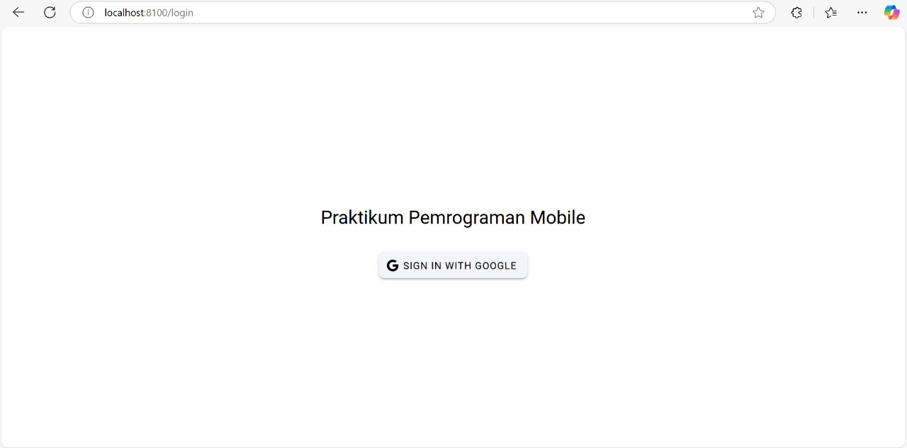
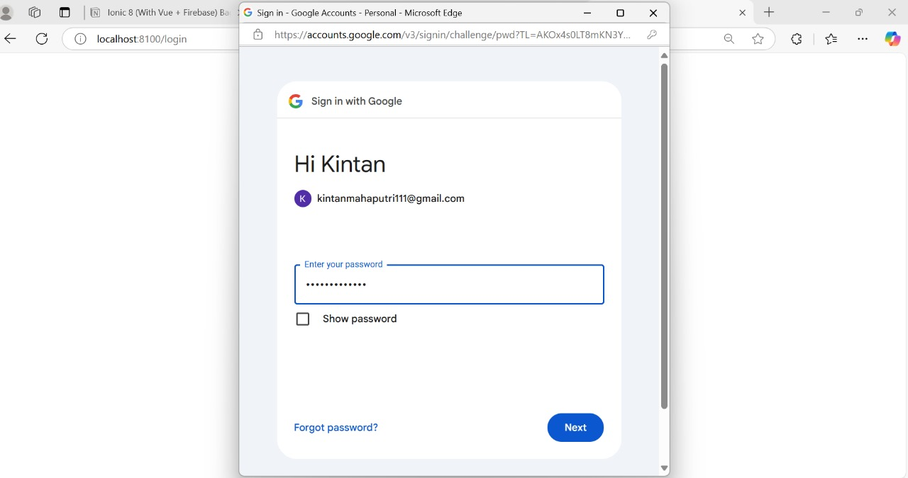
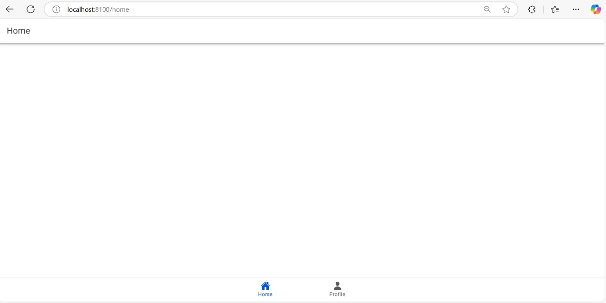
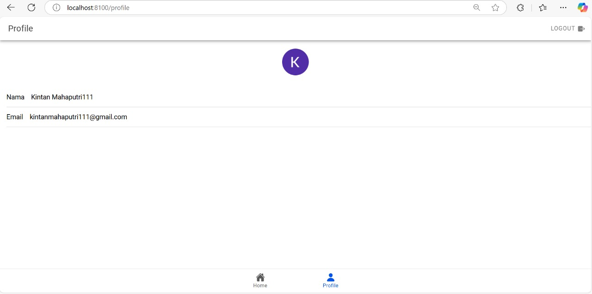

## KINTAN KINASIH MAHA PUTRI_H1D022019_IonicVueFirebase
Nama : Kintan Kinasih Mahaputri

NIM : H1D022019

Shift Baru: A

# Membuat Proyek di Firebase
a. Langkah pertama adalah membuat proyek di Firebase dan mengaktifkan opsi autentikasi menggunakan Google pada menu Authentication.  

b. Setelah proyek selesai dibuat, Firebase akan menyediakan konfigurasi khusus (firebaseConfig) yang diperlukan untuk menginisialisasi Firebase di aplikasi Ionic.
# Membuat Proyek Ionic dengan Vue.js
a. Setelah proyek Firebase selesai, kita membuat proyek Ionic baru menggunakan template Vue. Kemudian, kita menginstal Pinia untuk manajemen state dan Firebase SDK untuk menangani autentikasi Firebase.

b. Struktur folder dalam proyek Ionic mencakup beberapa folder utama, seperti src untuk menyimpan kode aplikasi, public untuk aset, router untuk mengatur navigasi, dan stores untuk mengelola status autentikasi dengan Pinia.

# Inisialisasi Firebase dalam Proyek Ionic
File firebase.ts dibuat di dalam folder utils untuk menginisialisasi Firebase dengan konfigurasi yang diambil dari Firebase Console. Selain itu, file ini juga berfungsi untuk mengatur autentikasi menggunakan auth dan menyiapkan googleProvider sebagai penyedia autentikasi Google.
# Membuat Fungsi Autentikasi (Sign-In dan Logout)
Di folder stores, kita membuat file auth.ts yang memanfaatkan Pinia untuk mengelola status autentikasi pengguna. Dalam file ini, terdapat fungsi loginWithGoogle yang digunakan untuk menginisialisasi proses autentikasi Google. Dengan GoogleAuth, aplikasi meminta izin untuk mengakses profil dan email pengguna. Setelah berhasil masuk, aplikasi menerima token ID dari Google yang diubah menjadi kredensial Firebase dan kemudian digunakan untuk proses signInWithCredential.  

Setelah proses login selesai, pengguna akan diarahkan ke halaman beranda (home). Selain itu, disediakan fungsi logout untuk keluar dari akun Google, menghapus sesi, dan mengembalikan pengguna ke halaman login (login).
# Membuat Halaman Login dan Profile
a. LoginPage: Halaman ini menyediakan tombol untuk pengguna masuk menggunakan akun Google. Ketika tombol tersebut diklik, fungsi loginWithGoogle dijalankan untuk memulai proses autentikasi.  

b. HomePage dan ProfilePage: Halaman profil menampilkan informasi pengguna, seperti nama dan email, yang diambil dari akun Google. Navigasi antara halaman utama (Home) dan halaman profil (Profile) dapat dilakukan melalui komponen TabsMenu.  

c. Di halaman profil, kita memanfaatkan authStore untuk mengakses detail pengguna, termasuk nama dan URL foto profil. Jika pengguna tidak memiliki foto profil, aplikasi akan menampilkan gambar default sebagai gantinya.
# Konfigurasi Router dengan Perlindungan Rute
a. Pada file index.ts di folder router, kita mendefinisikan rute aplikasi sekaligus menerapkan perlindungan pada halaman beranda dan profil agar hanya dapat diakses oleh pengguna yang telah login.  

b. Untuk setiap perpindahan rute, kita memanfaatkan `beforeEach` untuk memeriksa status autentikasi pengguna. Jika pengguna belum login, mereka akan dialihkan ke halaman login.
# Alur Autentikasi dan Mendapatkan Data Profil
a. Saat pengguna menekan tombol "Sign In with Google" di halaman login, fungsi `loginWithGoogle` memulai proses autentikasi melalui Google.  

b. Setelah login berhasil, aplikasi mendapatkan token ID dari Google, yang kemudian dikonversi menjadi kredensial Firebase. Firebase mencatat pengguna sebagai terautentikasi dan menyimpan data seperti nama serta foto profil mereka.  

c. Data ini disimpan di dalam authStore dan digunakan di seluruh aplikasi untuk menampilkan informasi profil serta memeriksa status autentikasi pengguna.

## Screenshot

